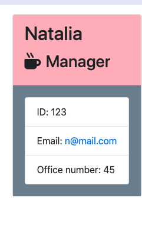
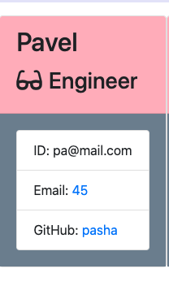
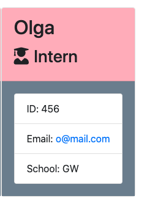
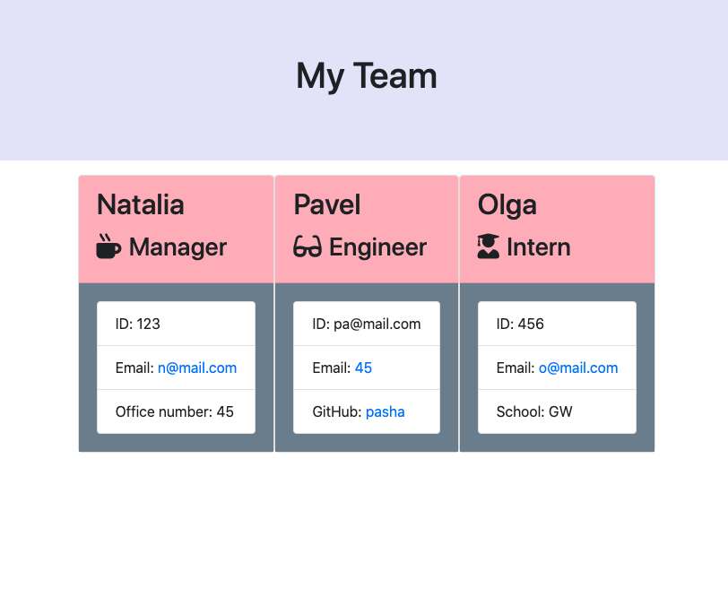
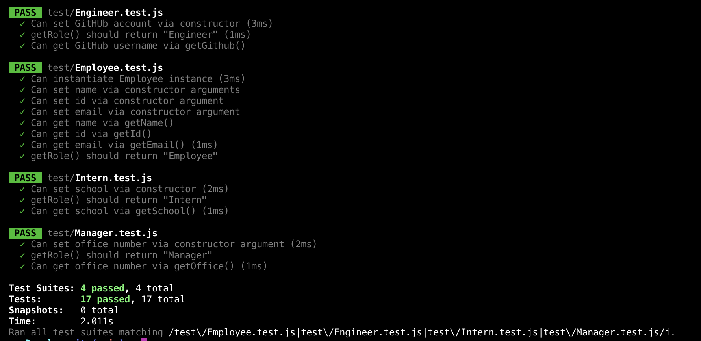

# EmployeeSummary

## Description
This Application allows users to create a team file by using a command-line. The application will prompt the user for information about the team manager and then information about the team members. The user can input any number of team members, and they may be a mix of engineers and interns.

## Table of Contents
* [Features](#features)
* [Installation](#installation)
* [Known Bugs](#known-bugs)
* [Support](#support)
* [Technologies Used](#technologies-used)
* [Contribution Guidlines](#contribution-guidlines)
* [License](#license)

## Features
* Manager card 

* Engineer card

* Intern card

* Generated team  

## Installation 
* Clone this repository.
* Open repository in your browser.
* Follow instructions on the video:

## Tests

* Unit tests stored in the test folder and can be run at any time with `npm run test`

## Known Bugs
None

## Support
Please email me for further questions at nasozontova@gmail.com

## Technologies Used
NodeJS
JavaScript
CSS
Jest

## Contribution Guidlines
Direct link to repository: https://github.com/NataliaSozontova/homeworkWeek10EmployeeSummary

## License
Copyright(c) 2021 Natalia Sozontova.